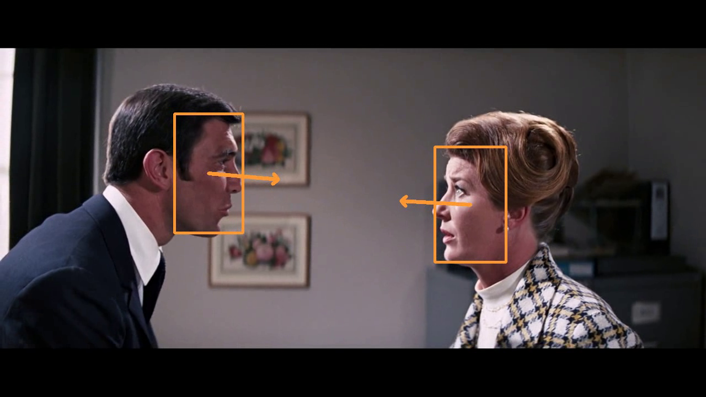

# Conversation Recongition
This repository contains the work for the lecture Scene Understanding & Surveillance (SUS) 2022.
We detect if people have a conversation by checking if people are looking at each other (LAEO) by using [6DRepNet](https://github.com/thohemp/6DRepNet/blob/master/README.MD) as basis.
It contains scripts to predict, evaluate and check if people are looking at each other in the develop folder and real-time inference with your webcam in the demo folder.

[](https://youtu.be/DTOmYopRU7Q)

## Installation

This project was created and tested with python version 3.8.13, torch 1.11 with cuda support on arch linux.

In order to run it, create a virtual environment and activate it using

```
python -m venv .venv
source .venv/bin/activate
```

Next, install the correct version for pytorch.
Use following command to run it on the cpu:

```
pip3 install torch torchvision torchaudio --extra-index-url https://download.pytorch.org/whl/cpu
```


then, use following command to install the requirements:

```
pip install -r requirements.txt
```

Download the [6DRepNet model](https://drive.google.com/file/d/1vPNtVu_jg2oK-RiIWakxYyfLPA9rU4R4/view?usp=sharing) from google drive and move it to the root of this working directory.
You can download our datasets and results [here](https://drive.google.com/drive/folders/1u_RM9XGGWpq856h1CHPBL7rCggHjBDF5?usp=sharing).

## Usage

To make predictions use the predict.py script in the develop folder.
For example like this:
```
python develop/predict.py data/scenes/scene2.mp4 --prediction pred.txt --vispath test.mp4
```
where
 - ```--prediction``` path to store the prediction per frame
 - ```--vispath``` if given stores the visualization at this path
 - ```--vis``` if enabled visualizes the prediction during runtime

In order to label the data you can use following command:

```
python develop/check.py video destination --prediction prediction
```

where
 - ``video`` is the path to the video to check. You can use the visualisation created with predict.py to qualitatively check the prediction

To calculate the accuracy, precision and recall as well as visualize them in a barplot you can run following command:
```
python develop/eval.py results predictions sota labels
```
where
 - *results* is the directory to store the results
 - *predictions* is the directory that contains all of the predicted videos
 - *sota* is the directory that contains the state-of-the-art results
 - *labels* is the directory that contains the ground truth labels

The predictions, sota and label files are expected to be named the same and contain a number and 1 for laeo and 0 for not laeo per line. Where one line corresponds to one frame in the video.

## Demo

Following command allows running head pose detection with a webcam:
```
python demo/pose.py
```

and following command exectues LAEO detection with a webcam:
```
python demo/laeo.py
```

## 6DRepNet

We heavily borrow code from [6dRepNet](https://github.com/thohemp/6DRepNet).

```
@misc{hempel20226d,
      title={6D Rotation Representation For Unconstrained Head Pose Estimation},
      author={Thorsten Hempel and Ahmed A. Abdelrahman and Ayoub Al-Hamadi},
      year={2022},
      eprint={2202.12555},
      archivePrefix={arXiv},
      primaryClass={cs.CV}
}
```